# American-Sign-language-Translation-Into-Text-Project

I am sorry, because There is no time I provide you with Just a Notebook without py files, model, data, config, train, preprocess, postprocess, augmentation, main, and requirements. I will work on this in the future to provide an update, so don't miss that.

Since Our Problem is to translate videos (sequence of frames) into sentences (sequence of words and characters), which is a seq2seq problem, so we have to use a state-of-art models like [Transformers](https://arxiv.org/abs/1706.03762) which is much better than [LSTM](https://arxiv.org/abs/1909.09586), [CRNN](https://arxiv.org/abs/1909.09586), or [RNN](https://arxiv.org/abs/1808.03314).

**Sign Language Translation**

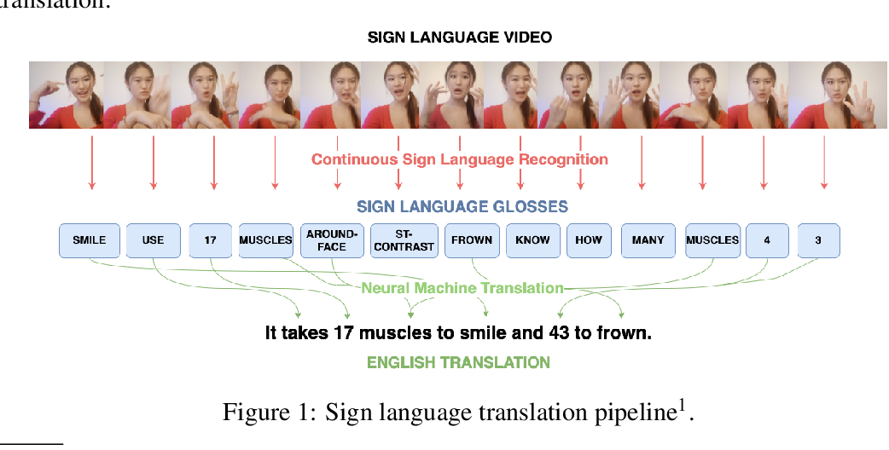

You Can find the data that I worked on here: [Data](https://www.kaggle.com/competitions/asl-fingerspelling/data)

# Related Works

Inference is performed by starting with an SOS token and predicting one character at a time using the previous prediction.

Inference requires the encoder to encode the input frames and subsequently use that encoding to predict the 1st character by inputting the encoding and SOS (Start of Sentence) token. Next, the encoding, SOS token and 1st predicted token are used to predict the 2nd character. Inference thus requires 1 call to the encoder and multiple calls to the encoder. On average a phrase is 18 characters long, requiring 18+1(SOS token) calls to the decoder.

Some inspiration is taken from the 1st place solution - training from the last Google - Isolated Sign Language Recognition competition.

Special thanks for all of these guys, Many many thanks to them:

https://www.kaggle.com/competitions/asl-fingerspelling/discussion/434364

[1st place solution] Improved Squeezeformer + TransformerDecoder + Clever augmentations: https://www.kaggle.com/competitions/asl-fingerspelling/discussion/434485

[5th place solution] Vanilla Transformer, Data2vec Pretraining, CutMix, and KD: https://www.kaggle.com/competitions/asl-fingerspelling/discussion/434415

https://www.kaggle.com/code/gusthema/asl-fingerspelling-recognition-w-tensorflow

This man helps me alot: https://www.kaggle.com/competitions/asl-fingerspelling/discussion/411060

# MLOPS
You can find my Neptune Project here: [Neptune.ai](https://app.neptune.ai/o/ASL-/org/ASL/runs/table?viewId=9aead532-6950-48b8-8705-bf902d065200)

# Our Solutions

**There are two approaches that I tried to solve this Problem, Note: I used TensorFlow library for building these two architectures:**

# First One

## Preprocessing

The processing is as follows:

1) Select dominant hand based on most number of non empty hand frames.

2) Filter out all frames with missing dominant hand coordinates.

3) Resize video to 256 frames.

4) Excluding samples with low frames per character ratio.

5) Added phrase type(Phone Number, URL, Address).

## General Info about the First solution

Tranformer Model 4.887.936 Million Parameters(Embedding+ Landmark Embedding+ Encoder(2 Encoder Blocks)+ Decoder(2 Decoder Blocks)+ 4 Attention Heads in Encoder and Decoder+ Causal Attention Masking), without Data Augmentation, Lips/Right_HAND/Left_HAND landmarkes, X/Y only without z, Preprocessing (Fill Nan with zeroes/ Filtering Empty Hand Frames/ PAD to zeros/Downsampling resize image to 128)), 100 Epochs, POD/SOS/EOS Tokens Used, 64 Batch Size, learning rate= 0.001, Weight Decay Ratio = 0.05, Maximum Phrase length 31+1 EOS Token, splitting 10% of the data into val_dataset and the other is for training.

## Evaluation

The Evaluation metrices used:

1) Levenshtein Distance(Train And Validation):

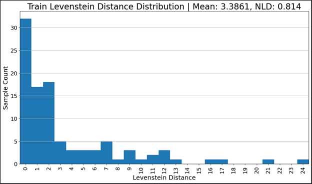

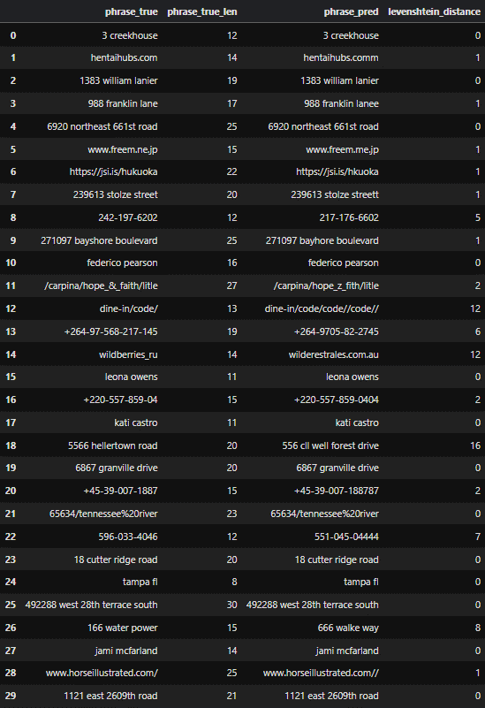

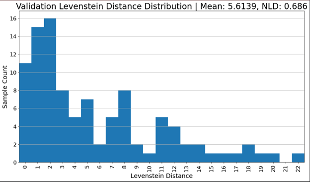

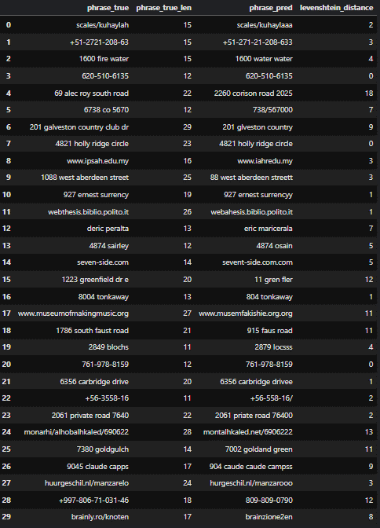

2) Sparse Categorical Crossentropy With Label Smoothing:

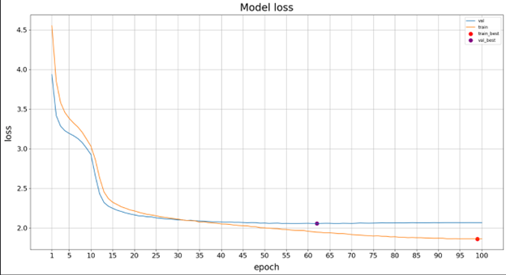

3) Top1Accuray:
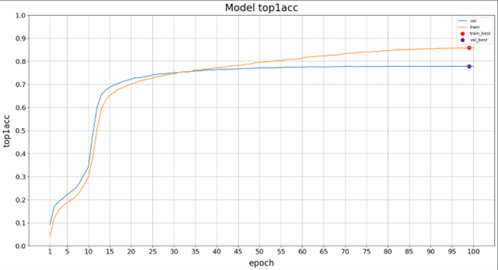

4) Top5Accuray:
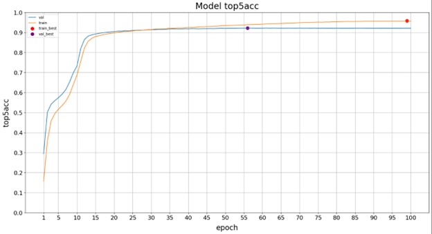

You can Found more about monitoring the results on this file: [Monitoring_Project_Performance](Monitoring_Project_Performance.docx)

ASL-32 is the best and we got it using this architecture, you can Found more details about statistics about results that we got here: [Neptune.ai](https://app.neptune.ai/o/ASL-/org/ASL/runs/table?viewId=9aead532-6950-48b8-8705-bf902d065200)

**Transformer Architecture**

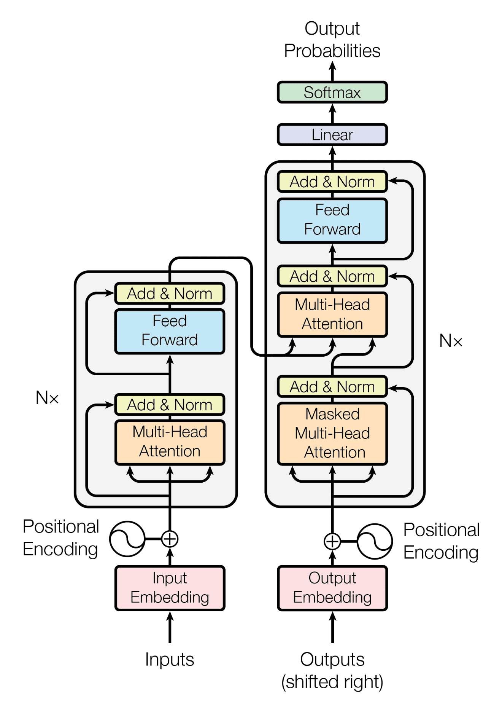

**My Transformer Architecture On the Code**
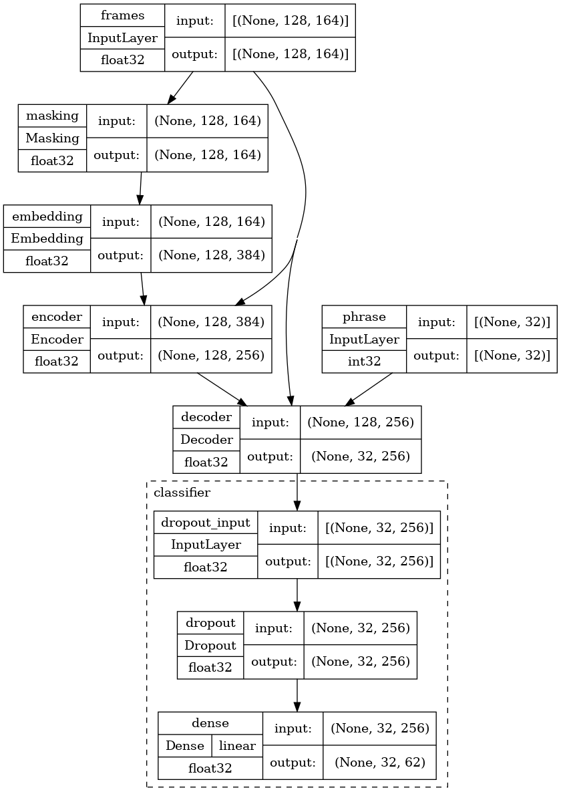

# Second One

The model consists of a Lankmark Embbeding + Conformer, 2 layer MLP landmark encoder + 6 layer 384-dim Conformer + 1 layer GRU. Total params: 15,892,142 Trainable params: 15,868,334 Non-trainable params: 23,808 It tooks like 7 hours to train were the epochs was 100 but I stop it because the loss didn't improve that much, I tried using Kaggle TPUs but it didn't so if you how to use them, **Note:** If the kaggle TPUs used the number of epochs will increase to 500 and the batch size will encrease as well using this piece of code: 

        # Increase number of epochs if the Multi GPUs are available
        if strategy.num_replicas_in_sync==2:
                N_EPOCHS = 400
                print("cuz 2 GPUs are available, so the number of epochs changes from 100 to : ", N_EPOCHS)

        # Increase number of epochs if the TPU is available
        if TPU:
                N_EPOCHS = 500
                print("cuz tpu is available, number of epochs would be:", N_EPOCHS)
        if TPU: 
                BATCH_SIZE = 25 * strategy.num_replicas_in_sync 
                print(BATCH_SIZE).

# Data Augmentation and Preprocessing 
Data Augmentation and Preprocessing was applied as follows:
## Preprocessing
1) Padding(short sequences), Resizing(longer sequences).
2) Mean Calculation with Ignoring Handling.
3) Standard Deviation Calculation with Ignoring NaN.
4) Normalization(Standardization).
5) Global Normalization(Standardization of the pose keypoints).
6) Splitting, rearranging , resizing (lips, hands, nose, eyes, and pose).
7) Interpolation(Resizes the sequence to a target length, Random interpolation).

## Augmentation
1) Random Spatial Rotation (finger keypoints, degree(-10,10)).
2) Random Scaling(scales finger keypoints, scale(0.9, 1.1)).
3) Rotation, Shear, Scaling(degree=(-15,15), shear=(-0.10,0.10), scale=(0.75,1.5).
4) Inner Flipping(around mean of coordinates).
5) Left-Right Flipping(rigth, Left body like Left, Right hand and so on for each left, right data aspect).
6) Random Rotation and Scaling(each finger individually).
7) Temporal Resampling(resampling the temporal length of the data sequence at a new rate).
8) Subsequence Resampling(resamples a subsection of the data sequence).
9) Masking(learns the mode to handle incomplete data).
10) Random Rotation and Scaling(for each finger individually).
11) Spatial Masking(spatial mask to a random part of the data).
12) Temporal Masking(Masks a random temporal segment of the data).
13) Random Shifting(shift_range=0.1).
14) Partial Rotation(Applies rotations to parts of the data or individual fingers, whole sequence or a subsection).
15) Partial Shifting.
16) Combined Masking(Combines temporal and feature masking in one step).
17) Composite Augmentation(applying a random combination of augmentation techniques).

## General Info about the Second solution

Number of Epochs= 100, BATCH_SIZE = 64, Number of Unique Characters To Predict + Pad Token + SOS Token + EOS Token= 62, Maximum Learning Rate= 1e-3, weight decay ration for learning rate = 0.05, Maximum phrase length 31+1 Eos Token, Number of frames to resize recording to is 384, Drop out ration was 0.1, Causal Masking is applied, landmarks (Nose 4 landmarks, Lips 41 landmarks, Pose 17 landmark, Eyes 16(R)+16(L)=32 landmarks, Hands 42 landmarks) In Total 42+76+33 = 151 (HAND_NUMS 42, FACE_NUMS 76, POSE_NUMS 33), X/Y/Z used that means we add the depth in this approach, split the data into train size = 66208, and val size = 1000. 

**Conformer Architecture**
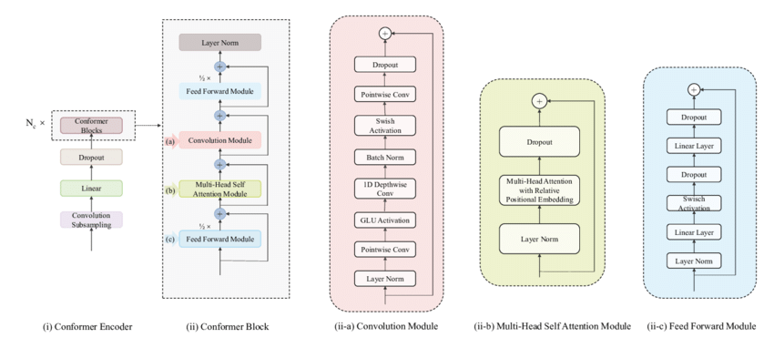

## Evaluation

Conformer run was ASL-27 in [Neptune.ai](https://app.neptune.ai/o/ASL-/org/ASL/runs/table?viewId=9aead532-6950-48b8-8705-bf902d065200), it was not that good, because I didn't give that much time to modify the code to work in the best way and to modify the model architecture (change the number of heads, coformer blocks, decoder blocks, change the landmark indicies, remove z, add or remove augmentation techniques), actually there are a lot of reasons behind this or maybe the whole idea of conformer is wrong.

# Conclusion

Since there is no time to try these concepts to solve this problem, I think using clever augmentation from the first place solution with GNN, Flash Attention, or [STMC transformer](https://aclanthology.org/2020.coling-main.525.pdf) will give a better Performance. Try to solve this problem by using the simple solutions and then go deeper with more complex solutions. Thanks a lot if you reach this part. And try to use Supplementary dataset, since the top solutions in this competition used Supplementary dataset and they said it was a useful.

# What Did't Work In the two architectures

1) Using Conformer, I talked about this.
2) In Transformer, Increasing the number of Encoder Blocks from 4 to 8 , number of Decoder Blocks from 2 to 4, Number of Attention Heads from 4 to 8 and Multi Layer Perception Ration from 2 to 4, which in total gives 14.7 Million trainable Parameteres.
3) Including Z the depth.

