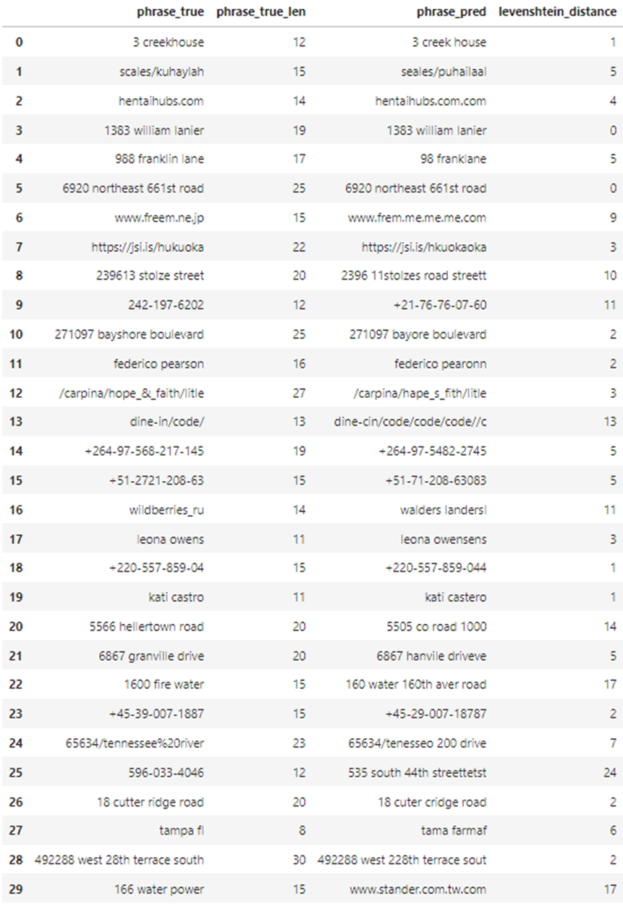
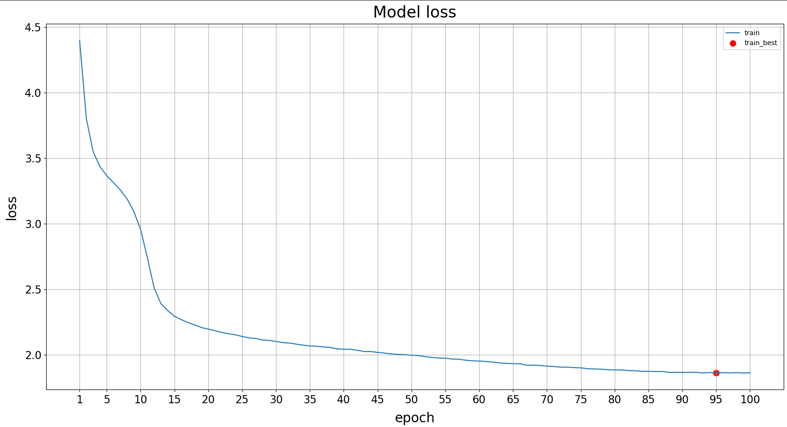
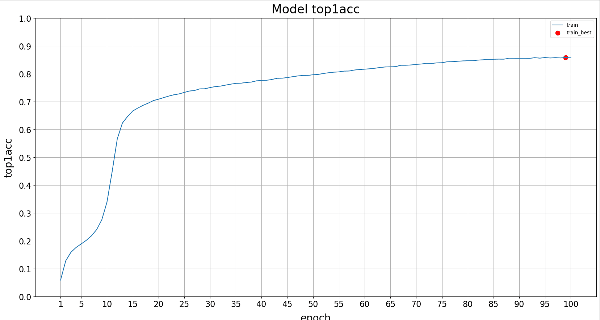
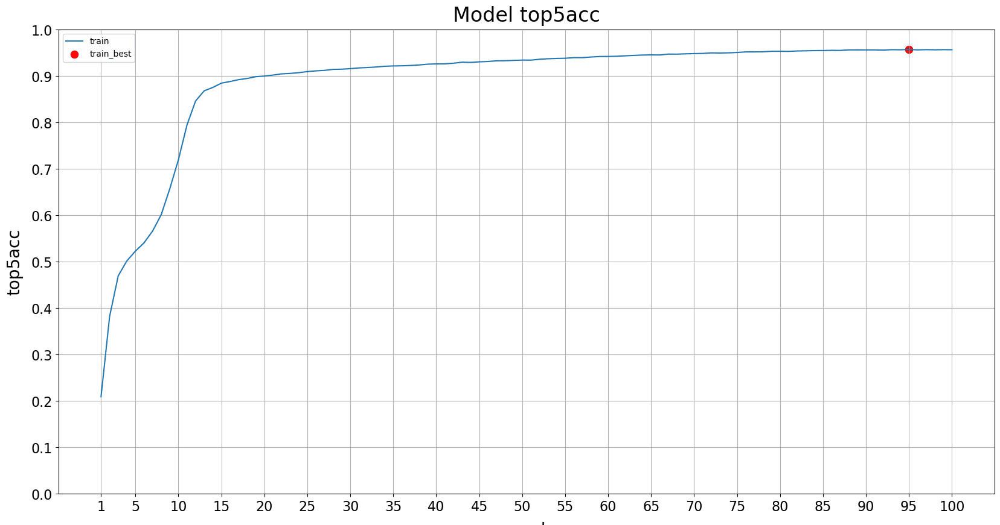

# American-Sign-language-Translation-Into-Text-Project

I am sorry, because There is no time I provide you with Just a Notebook without py files, model, data, config, train, preprocess, postprocess, augmentation, main, and requirements. I will work on this in the future to provide an update, so don't miss that.

Since Our Problem is to translate videos (sequence of frames) into sentences (sequence of words and characters), which is a seq2seq problem, so we have to use a state-of-art models like [Transformers](https://arxiv.org/abs/1706.03762) which is much better than [LSTM](https://arxiv.org/abs/1909.09586), [CRNN](https://arxiv.org/abs/1909.09586), or [RNN](https://arxiv.org/abs/1808.03314).

**Sign Language Translation**

You Can find the data that I worked on here: [Data](https://www.kaggle.com/competitions/asl-fingerspelling/data)

# Related Works

Inference is performed by starting with an SOS token and predicting one character at a time using the previous prediction.

Inference requires the encoder to encode the input frames and subsequently use that encoding to predict the 1st character by inputting the encoding and SOS (Start of Sentence) token. Next, the encoding, SOS token and 1st predicted token are used to predict the 2nd character. Inference thus requires 1 call to the encoder and multiple calls to the encoder. On average a phrase is 18 characters long, requiring 18+1(SOS token) calls to the decoder.

Some inspiration is taken from the 1st place solution - training from the last Google - Isolated Sign Language Recognition competition.

Special thanks for all of these guys, Many many thanks to them:

https://www.kaggle.com/competitions/asl-fingerspelling/discussion/434364

[1st place solution] Improved Squeezeformer + TransformerDecoder + Clever augmentations: https://www.kaggle.com/competitions/asl-fingerspelling/discussion/434485

[5th place solution] Vanilla Transformer, Data2vec Pretraining, CutMix, and KD: https://www.kaggle.com/competitions/asl-fingerspelling/discussion/434415

https://www.kaggle.com/code/gusthema/asl-fingerspelling-recognition-w-tensorflow

This man helps me alot: https://www.kaggle.com/competitions/asl-fingerspelling/discussion/411060

# MLOPS
You can find my Neptune Project here: [Neptune.ai](https://app.neptune.ai/o/ASL-/org/ASL/runs/table?viewId=9aead532-6950-48b8-8705-bf902d065200)

# Our Solutions

**There are two approaches that I tried to solve this Problem, Note: I used TensorFlow library for building these two architectures:**

# First One

The processing is as follows:

1) Select dominant hand based on most number of non empty hand frames.

2) Filter out all frames with missing dominant hand coordinates.

3) Resize video to 256 frames.

4) Excluding samples with low frames per character ratio.

5) Added phrase type.

Tranformer Model 4.887.936 Million Parameters(Embedding+ Landmark Embedding+ Encoder(2 Encoder Blocks)+ Decoder(2 Decoder Blocks)+ 4 Attention Heads in Encoder and Decoder+ Causal Attention Masking), without Data Augmentation, Lips/Right_HAND/Left_HAND landmarkes, X/Y only without z, Preprocessing (Fill Nan with zeroes/ Filtering Empty Hand Frames/ PAD to zeros/Downsampling resize image to 128)), 100 Epochs, POD/SOS/EOS Tokens Used, 64 Batch Size, learning rate= 0.001, Weight Decay Ratio = 0.05, Maximum Phrase length 31+1 EOS Token.

The Evaluation metrices used:

1) Levenshtein Distance:

.png)

2) Sparse Categorical Crossentropy With Label Smoothing:

3) Top1Accuray:

4) Top5Accuray:

You can Found more about monitoring the results on this file: [Monitoring_Project_Performance](Monitoring_Project_Performance.docx)

You can Found more details about statistics about results that we got here: [Neptune.ai](https://app.neptune.ai/o/ASL-/org/ASL/runs/table?viewId=9aead532-6950-48b8-8705-bf902d065200)

**Transformer Architecture**

**My Transformer Architecture On the Code**

# Second One

The model consists of a Lankmark Embbeding + Conformer, 2 layer MLP landmark encoder + 6 layer 384-dim Conformer + 1 layer GRU.
Total params: 15,892,142
Trainable params: 15,868,334
Non-trainable params: 23,808
It tooks like 8 hours to train were the epochs was 100, I tried using Kaggle TPUs but it didn't so if you how to use them, Note: If the kaggle TPUs used the number of epochs will increase to 500 and the batch size will encrease as well using this piece of code:
[
if TPU:
    BATCH_SIZE = 25 * strategy.num_replicas_in_sync
    print(BATCH_SIZE)]

Data Augmentation was applied:

Number of Epochs= 100, BATCH_SIZE = 64, Number of Unique Characters To Predict + Pad Token + SOS Token + EOS Token= 62, Maximum Learning Rate= 1e-3, weight decay ration for learning rate = 0.05, Maximum phrase length 31+1 Eos Token, Number of frames to resize recording to is 384, Drop out ration was 0.1, Causal Masking is applied, landmarks (Nose 4 landmarks, Lips 41 landmarks, Pose 17 landmark, Eyes 16(R)+16(L)=32 landmarks, Hands 42 landmarks) In Total 42+76+33 = 151 (HAND_NUMS 42, FACE_NUMS 76, POSE_NUMS 33).

